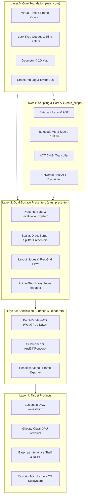

# Eatsbits Engine Deconstruction & Architectural Blueprint

> **Vision:** Reverse-engineering a high-performance, web-first, mobile-first, dual-surface (GUI + TUI) game & app engine from Eatsbeats, powered by the Pythonic Eatscript DSL, a WebGPU renderer, a Ghostty-class GPU terminal, and a future-ready OS architecture.

---

## 1. Executive Assessment & Philosophy

### 1.1 The "Reverse Engine" Strategy
Building an abstract engine forward in a vacuum is historically prone to the **Second-System Effect**: over-engineered abstractions that fail when confronted with real-world latency, threading, and rendering bottlenecks.

By building **Eatsbeats** (a real-time DAW with hard real-time audio constraints, 60–120 FPS vector graphics, high-density DSP graphs, and microsecond scheduling), we stress-tested the most brutal problem domain in modern software. 

Deconstructing this hardened codebase into an engine is not only valid—it is the optimal path. Every abstraction extracted will have been battle-tested against real computational pressure.

### 1.2 Cognitive Health & Codebase Optimization
Addressing these modularity gaps is not an abstract exercise for a distant goal; **it immediately solves day-to-day development friction in Eatsbeats**:
* **Cognitive Ergonomics & Local Reasoning:** Decoupling eliminates "spooky action at a distance." Modifying a visual widget won't risk breaking audio callbacks or window drag handlers.
* **AI Pair-Programming Velocity (Gemini / Antigravity):** High-modularity codebases with headless interfaces fit within model context windows and allow LLM agents to write localized, robust features and isolated unit tests without touching monolithic files.
* **Testability:** Headless presenters can be tested across 1,000 assertions in milliseconds without initializing a GLFW window, WebGPU device, or audio hardware.

---

## 2. Architectural Pillars

---

## 3. The Existing Gaps & Immediate Benefits

| Subsystem Gap | Current State in Eatsbeats | Target Engine Architecture | Immediate Benefit to Eatsbeats |
| :--- | :--- | :--- | :--- |
| **1. UI Hierarchy & Window God Object** | `gui_window.cpp` acts as window manager, graphics context holder, hit-tester, and state machine. | Generic `Node2D` / `Element` hierarchy with tree propagation for layout, clipping, and events. | Cleans up `gui_window.cpp` (>15,000 lines), making UI bug fixes fast and safe. |
| **2. Input Model (Mouse vs. Touch/Web)** | Tightly bound to desktop GLFW mouse coords and buttons. | Unified `PointerEvent` supporting mouse, multi-touch, pen/stylus, and virtual pinch/zoom. | Unlocks mobile browser support and tablet touch mixing for the DAW immediately. |
| **3. Eatscript Independence** | Bound to MIDI/FX pipelines and plugin structures. | Standalone CLI, bytecode compiler, and universal host ABI binding. | Allows writing scripts, tests, and DAW automation without running audio hardware. |
| **4. Terminal vs. Terminal Emulator** | `CellSurface` is a TUI client writing ANSI to stdout. | WebGPU-accelerated terminal emulator capable of hosting PTYs, font shaping, and glyph atlases. | Lays the groundwork for rich in-DAW terminal consoles and the Ghostty-class terminal. |

---

## 4. Phased Deconstruction Roadmap

### Phase 1: Foundation & Presentation Decoupling (Immediate)
* **Goal:** Maximize local reasoning inside Eatsbeats while isolating reusable engine primitives.
* **Action Items:**
  1. **Pointer/Touch Normalization:** Refactor [IDragHandler](file:///c:/git/eatsbits/include/eatsbits/presenter/drag_handler.hpp) and interaction presenters to take an abstract `PointerEvent` (position, delta, pointerId, pressure, modifier flags) rather than raw GLFW mouse state.
  2. **Scene Hierarchy Primitives:** Extract a lightweight `Element2D` interface for layout bounds, hit testing, and dirty flags, decoupling widgets from direct `GuiWindow` coordination.
  3. **Event-Driven Idle Loop Solidification:** Ensure all views and presenters adhere to the virtual time context ([gui-mvp.md](file:///c:/git/eatsbits/gui-mvp.md#L128)) for both zero-CPU idle sleeping and non-realtime headless export.

### Phase 2: Eatscript Generalization & Host ABI
* **Goal:** Elevate Eatscript from an audio-specific DSP scripter to a universal application DSL.
* **Action Items:**
  1. **Generic Host Reflection ABI:** Generalize [eats_plugin_abi.h](file:///c:/git/eatsbits/include/eatsbits/abi/eats_plugin_abi.h) to support arbitrary function dispatch, structs, and memory buffers.
  2. **Standalone `eatscript` CLI:** Create a standalone executable target (`eatscript_cli`) that compiles, executes, or transpiles `.eats` scripts without linking audio DSP engines.
  3. **Standard Library Foundations:** Add native host bindings for file I/O, process execution, string manipulation, and math.

### Phase 3: WebGPU Terminal & Eatscript Shell [COMPLETED]
* **Goal:** Build the terminal runtime that will power both the standalone terminal app and future OS shell.
* **Status:** 100% Completed & Verified in `test_webgpu_terminal` (all 40 unit test suites passing).
* **Action Items:**
  1. **WebGPU Glyph Atlas:** Create a high-throughput monospace text and glyph renderer inside [BatchRenderer2D](file:///c:/git/eatsbits/include/eatsbits/ui/batch_renderer_2d.hpp) with subpixel positioning, built-in 8x16 bitmap font atlas ([monospace_font_8x16.hpp](file:///c:/git/eatsbits/include/eatsbits/ui/monospace_font_8x16.hpp)), and custom vector box-drawing shaders/quads (`U+2500`–`U+257F`, `U+2580`–`U+259F`, `U+2800`–`U+28FF`).
  2. **PTY / ANSI Parser Pipeline:** Implement a VT100/Xterm byte stream parser ([ansi_parser.hpp](file:///c:/git/eatsbits/include/eatsbits/terminal/ansi_parser.hpp)) feeding a decoupled, double-buffered terminal cell grid ([terminal_grid.hpp](file:///c:/git/eatsbits/include/eatsbits/terminal/terminal_grid.hpp)) with scrollback history, alternate screen buffer, and 24-bit TrueColor/256-color support.
  3. **Interactive Eatscript Shell:** Build an interactive REPL/shell ([repl.hpp](file:///c:/git/eatsbits/include/eatsbits/eatscript/repl.hpp)) where command execution yields structured, inspectable `Value` objects with ANSI syntax formatting, multi-line block continuation, history navigation, and symbol auto-completion (`math.*`, `sys.*`, `fs.*`, host functions).

### Phase 4: Standalone Engine Extraction (`eats_engine`) [COMPLETED]
* **Goal:** Extract cleanly separated CMake targets and libraries:
  * `eats_core`: Zero-dependency utilities, time, memory, math, geometry primitives ([frame_time_context.hpp](file:///c:/git/eatsbits/include/eatsbits/core/frame_time_context.hpp), [geometry.hpp](file:///c:/git/eatsbits/include/eatsbits/core/geometry.hpp), [color.hpp](file:///c:/git/eatsbits/include/eatsbits/core/color.hpp)).
  * `eats_script`: Lexer, parser, bytecode VM, and AOT transpiler.
  * `eats_presenter`: Headless presentation logic, dual-surface state machines, input, and Element2D scene hierarchy.
  * `eats_render_wgpu`: Hardware-accelerated 2D batch renderer (Dawn/WebGPU), monospace atlas, and vector glyph rasterizer.
  * `eats_render_tui`: ANSI diff cell surface, TerminalGrid, and VT100/Xterm ANSI state machine.
  * `eats_audio`: Real-time DSP graph, synthesis nodes, step sequencer, and audio project serialization.
  * `eats_video_export`: Deterministic headless audio-visual video and frame exporter ([headless_video_exporter.hpp](file:///c:/git/eatsbits/include/eatsbits/export/headless_video_exporter.hpp)).
  * `eatsbits`: The flagship DAW app linking the above modular components.
* **Status:** 100% Completed & Verified in `test_headless_video_exporter` (all 41 test suites passing).

---

## 5. Guidelines for Gemini / Antigravity Pair-Programming

To maintain momentum and avoid regressions when executing this roadmap with AI agents:

1. **Enforce Headless-First Implementation:**
   - Always implement presenter state machines and models *before* connecting pixel or ANSI renderers.
   - Every presenter must have a dedicated unit test in `tests/` that runs in under 5ms without GUI/audio dependencies.
2. **Preserve Zero-Allocation Real-Time Contracts:**
   - Any code touched within the audio render path or 60 FPS hot loop must not allocate memory (`new`, `malloc`, `std::string` copies) or block on mutexes.
3. **One Subsystem Per Iteration:**
   - Avoid massive horizontal refactors across all files simultaneously. Follow the vertical slice approach: decouple a single widget/presenter (e.g., `ValueEditDialog` -> `ValueEditPresenter`), verify 100% test pass, and commit.
4. **Target Modern Web & Mobile Standards:**
   - Do not introduce OpenGL, legacy desktop OS APIs, or platform-specific hacks. Stick strictly to C++20, WebGPU/Dawn primitives, and ANSI/UTF-8 terminal standards.
