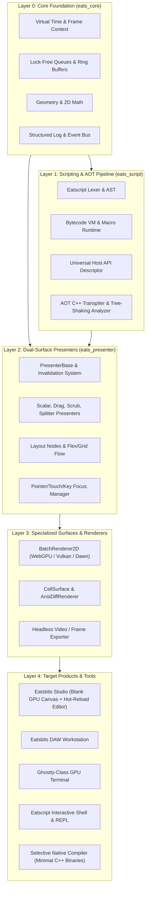

# Eatsbits Engine Deconstruction & Architectural Blueprint

> **Vision:** Reverse-engineering a high-performance, web-first, mobile-first, dual-surface (GUI + TUI) game & application engine from Eatsbits. Powered by the Pythonic Eatscript DSL, a WebGPU/Vulkan GPU canvas renderer, a Ghostty-class GPU terminal, a live-reloading script studio, and an AOT transpiler with selective dead-code stripping.

---

## 1. Executive Assessment & Philosophy

### 1.1 The "Reverse Engine" Strategy
Building an abstract engine forward in a vacuum is historically prone to the **Second-System Effect**: over-engineered abstractions that fail when confronted with real-world latency, threading, and rendering bottlenecks.

By building **Eatsbits** (a real-time DAW with hard real-time audio constraints, 60–120 FPS vector graphics, high-density DSP graphs, and microsecond scheduling), we stress-tested the most demanding problem domain in modern software. 

Deconstructing this hardened codebase into an engine is not only valid—it is the optimal path. Every abstraction extracted has been battle-tested against real computational pressure.

### 1.2 Cognitive Health & Codebase Optimization
Addressing modularity gaps is not an abstract exercise for a distant goal; **it immediately solves day-to-day development friction in Eatsbits**:
* **Cognitive Ergonomics & Local Reasoning:** Decoupling eliminates "spooky action at a distance." Modifying a visual widget won't risk breaking audio callbacks or window drag handlers.
* **AI Pair-Programming Velocity (Gemini / Antigravity):** High-modularity codebases with headless interfaces fit within model context windows and allow LLM agents to write localized, robust features and isolated unit tests without touching monolithic files.
* **Testability:** Headless presenters can be tested across 1,000 assertions in milliseconds without initializing a GLFW window, WebGPU device, or audio hardware.

### 1.3 The "Live Scripting to Selective Native" Paradigm
Traditional game and app engines suffer from a dual-workflow disconnect:
* **The Scripting Trap (LÖVE, Godot, Python):** Developers enjoy fast iteration in dynamic languages, but cannot easily export to native C++ without maintaining a second disparate codebase or embedding a bloated runtime and dynamic VM.
* **The Monolithic Runtime Problem:** Most engines ship large, all-inclusive runtimes where even a simple 2D app carries the weight of unused physics, 3D render pipelines, and audio subsystems.

**The Eatsbits Solution:**
Eatscript is designed from the ground up as a dual-mode application DSL:
1. **Interactive Prototyping:** A lightweight runner (`eats_runner` / `eats_studio`) mounts a blank GPU canvas alongside an integrated script editor, enabling sub-millisecond hot-reloading.
2. **Selective AOT C++ Export:** Because Eatscript AST nodes and standard library constructs map 1:1 to the native C++ engine API, the export pipeline analyzes symbol usage, strips unreferenced engine modules (e.g. omitting `eats_audio` when only 2D UI is used), and emits clean, human-readable C++ with an optimized CMake configuration.

---

## 2. Architectural Pillars

---

## 3. The Existing Gaps & Target Engine Architecture

| Subsystem Gap | Current State in Eatsbits | Target Engine Architecture | Immediate Benefit to Eatsbits |
| :--- | :--- | :--- | :--- |
| **1. UI Hierarchy & Window God Object** | `gui_window.cpp` coordinates window management, graphics context, hit-testing, and state. | Generic `Node2D` / `Element` hierarchy with tree propagation for layout, clipping, and events. | Cleans up `gui_window.cpp`, making UI bug fixes fast, modular, and safe. |
| **2. Input Model (Mouse vs. Touch/Web)** | Desktop mouse input historically predominated; mobile input toolbar & proxy input now landed in Web. | Unified `PointerEvent` supporting mouse, multi-touch, pen/stylus, and virtual gesture recognition across all targets. | Complete touch parity across mobile WebAssembly and native tablet builds. |
| **3. Eatscript Independence & Tooling** | Integrated with audio modular rack and DSP parameters; micro-lexer and syntax theming implemented in editor. | Standalone CLI, AST-level transpiler, multi-file module loader (`import`), and interactive REPL. | Enables scripting, automated UI generation, and unit testing without launching audio devices. |
| **4. Terminal vs. Terminal Emulator** | WebGPU-accelerated terminal emulator with VT100/Xterm parser, double-buffered grid, and PTY support completed. | Reusable `TerminalGrid` and `AnsiParser` shared across in-app CLI drawer, standalone terminal, and remote debugger. | Unified high-performance console across both GUI and headless TUI environments. |
| **5. Live Application Runner & AOT Export** | Apps are compiled as monolithic C++ binaries. | `eats_runner` providing a blank GPU canvas with hot-reloading `.eats` scripts, plus one-click selective native C++ export. | Rapid interactive app authoring with production deployment down to tiny, zero-dependency native binaries. |

---

## 4. Phased Deconstruction Roadmap

### Phase 1: Foundation & Presentation Decoupling [IN PROGRESS]
* **Goal:** Maximize local reasoning inside Eatsbits while isolating reusable engine primitives.
* **Key Achievements & Action Items:**
  1. **Pointer/Touch Normalization:** Unified `PointerEvent` abstractions, `CodeAccessoryToolbar` for mobile touch input, and Emscripten soft-keyboard bridge integrated.
  2. **Scene Hierarchy Primitives:** Extract lightweight `Element2D` interface for layout bounds, hit testing, and dirty flags, decoupling widgets from direct `GuiWindow` coordination.
  3. **Event-Driven Idle Loop:** Ensure all views and presenters adhere to virtual time context ([gui-mvp.md](file:///c:/git/eatsbits/gui-mvp.md#L128)) for zero-CPU idle sleeping and non-realtime headless rendering.

### Phase 2: Eatscript Generalization & Host ABI [IN PROGRESS]
* **Goal:** Elevate Eatscript from an audio-specific DSP scripter to a universal application DSL.
* **Action Items:**
  1. **Generic Host Reflection ABI:** Generalize [eats_plugin_abi.h](file:///c:/git/eatsbits/include/eatsbits/abi/eats_plugin_abi.h) to support arbitrary GUI widget construction, event binding, and memory buffers.
  2. **Module System & Import Resolution:** Support multi-file scripts (`import "ui/components.eats"`) with circular dependency protection and scoped symbol tables.
  3. **Standalone `eatscript` CLI & REPL:** Standalone executable target (`eatscript_cli`) that compiles, validates, executes, or transpiles `.eats` scripts without linking audio DSP engines.

### Phase 3: WebGPU Terminal & Eatscript Shell [COMPLETED]
* **Goal:** Build the terminal runtime powering both the in-DAW console drawer and future standalone terminal apps.
* **Status:** 100% Completed & Verified in `test_webgpu_terminal` (all 40 unit test suites passing).
* **Delivered Components:**
  1. **WebGPU Glyph Atlas:** High-throughput monospace text renderer inside [BatchRenderer2D](file:///c:/git/eatsbits/include/eatsbits/ui/batch_renderer_2d.hpp) with subpixel positioning, built-in 8x16 bitmap font atlas ([monospace_font_8x16.hpp](file:///c:/git/eatsbits/include/eatsbits/ui/monospace_font_8x16.hpp)), and custom box-drawing/block-element quads.
  2. **PTY / ANSI Parser Pipeline:** VT100/Xterm byte stream parser ([ansi_parser.hpp](file:///c:/git/eatsbits/include/eatsbits/terminal/ansi_parser.hpp)) feeding a double-buffered cell grid ([terminal_grid.hpp](file:///c:/git/eatsbits/include/eatsbits/terminal/terminal_grid.hpp)) with 24-bit TrueColor support.
  3. **Interactive Eatscript Shell:** REPL/shell ([repl.hpp](file:///c:/git/eatsbits/include/eatsbits/eatscript/repl.hpp)) yielding structured, inspectable values with syntax formatting and history navigation.

### Phase 4: Standalone Engine Extraction (`eats_engine`) [COMPLETED]
* **Goal:** Extract cleanly separated CMake targets and libraries:
  * `eats_core`: Zero-dependency utilities, time, memory, math, geometry primitives ([frame_time_context.hpp](file:///c:/git/eatsbits/include/eatsbits/core/frame_time_context.hpp), [geometry.hpp](file:///c:/git/eatsbits/include/eatsbits/core/geometry.hpp), [color.hpp](file:///c:/git/eatsbits/include/eatsbits/core/color.hpp)).
  * `eats_script`: Lexer, parser, bytecode VM, and syntax micro-lexer with full theme token integration.
  * `eats_presenter`: Headless presentation logic, dual-surface state machines, input, and Element2D scene hierarchy.
  * `eats_render_wgpu`: Hardware-accelerated 2D batch renderer (Dawn/WebGPU), monospace atlas, and vector glyph rasterizer.
  * `eats_render_tui`: ANSI diff cell surface, TerminalGrid, and VT100/Xterm ANSI state machine.
  * `eats_audio`: Real-time DSP graph, synthesis nodes, step sequencer, and audio project serialization.
  * `eats_video_export`: Deterministic headless audio-visual video and frame exporter ([headless_video_exporter.hpp](file:///c:/git/eatsbits/include/eatsbits/export/headless_video_exporter.hpp)).
  * `eatsbits`: The flagship DAW app linking the above modular components.
* **Status:** 100% Completed & Verified in `test_headless_video_exporter` (all 44 test suites passing).

### Phase 5: Live Scripting Studio & Selective Native Compiler (`eats_runner`) [PLANNED]
* **Goal:** Deliver the standalone canvas runner and AOT tree-shaking export workflow.
* **Action Items:**
  1. **`eats_runner` Canvas Host:** A minimal host app featuring:
     * A blank, high-performance GPU canvas viewport (WebGPU/Vulkan/SDL3).
     * An integrated or detached code editor window powered by [TextEditorWidget](file:///c:/git/eatsbits/include/eatsbits/ui/widgets/text_editor_widget.hpp) with live syntax theming and auto-pairing.
     * File-watcher and hot-reload triggers that evaluate `app.eats` on save without terminating the process.
     * Exception sandboxing: Syntax and runtime errors surface directly in the console drawer without crashing the host canvas.
  2. **Live State Retention:** Provide a persistent state dictionary (`state.get()` / `state.set()`) so hot-reloads preserve active user inputs, camera positions, and values across edits.
  3. **Selective AOT C++ Transpiler:**
     * Static AST analyzer that records all engine APIs and subsystems referenced in the script.
     * Code emitter producing clean C++ calling native `eats::gui`, `eats::render`, or `eats::audio` functions.
     * CMake generator configuring only the necessary subsystem targets (e.g., producing a pure GUI/graphics executable of <2MB by stripping audio and video export dependencies).

---

## 5. Guidelines for Gemini / Antigravity Pair-Programming

To maintain momentum and avoid regressions when executing this roadmap with AI agents:

1. **Enforce Headless-First Implementation:**
   - Always implement presenter state machines and models *before* connecting pixel or ANSI renderers.
   - Every presenter must have a dedicated unit test in `tests/` running in under 5ms without GUI/audio dependencies.
2. **Preserve Zero-Allocation Real-Time Contracts:**
   - Any code touched within the audio render path or 60 FPS hot loop must not allocate memory (`new`, `malloc`, `std::string` copies) or block on mutexes.
3. **One Subsystem Per Iteration:**
   - Avoid massive horizontal refactors across all files simultaneously. Follow the vertical slice approach: decouple a single widget/presenter (e.g., `ValueEditDialog` -> `ValueEditPresenter`), verify 100% test pass, and commit.
4. **Target Modern Web & Mobile Standards:**
   - Do not introduce OpenGL, legacy desktop OS APIs, or platform-specific hacks. Stick strictly to C++20, WebGPU/Dawn primitives, and ANSI/UTF-8 terminal standards.
5. **Dogfood via `eats_runner`:**
   - When building new UI or layout features, write the proof-of-concept in Eatscript first to validate API ergonomics before hardcoding complex C++ widget logic.
