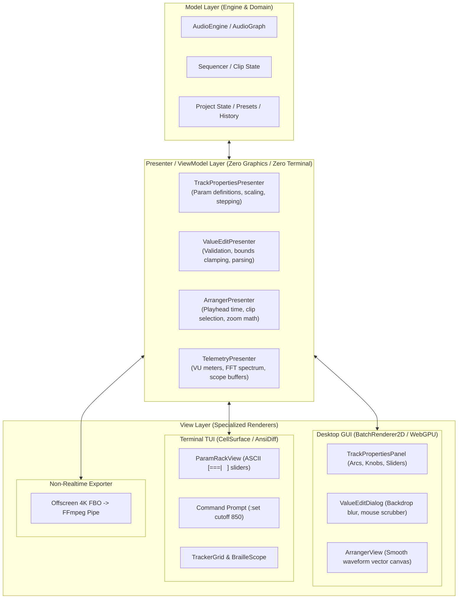

# Eatsbits GUI/TUI Architecture Blueprint: Unified MVP Core

## 1. Executive Summary & Vision

Eatsbits is evolving beyond a standalone graphical application into a multi-surface modular audio workstation:
1. **Desktop GUI:** High-performance, hardware-accelerated 2D vector interface ([BatchRenderer2D](include/eatsbits/ui/batch_renderer_2d.hpp), WebGPU / NanoVG).
2. **Terminal TUI:** Ultra-low latency, keyboard-centric terminal DAW for SSH, headless servers, and retro-computing workflows ([CellSurface](include/eatsbits/tui/cell_surface.hpp), ANSI diffing).
3. **Headless Video Exporter:** Deterministic, non-realtime renderer capable of outputting frame-perfect audio/visualizer video at arbitrary resolutions (4K, 8K) and framerates (60/120 FPS).

To achieve this without duplicating codebase logic or creating fragile bindings, Eatsbits adopts a **Model-View-Presenter (MVP)** architecture designed from the ground up for zero-allocation performance, dirty tracking, and virtualized time.

---

## 2. The Current Problem: GUI Fragmentation & TUI Divergence

The current codebase displays classic growing pains of custom-crafted graphical engines:

* **The God Object (`gui_window.cpp` ~680 KB, ~15,000+ lines):**
  [GuiWindow](include/eatsbits/ui/gui_window.hpp) acts as window manager, graphics context holder, input router, and monolithic state machine. It manages dozens of manual drag states (`DragMode::Knob`, `DragMode::ArrangerTrackVolume`, `DragMode::MixerPan`, etc.) with ad-hoc hit-testing and event dispatching.
* **Entangled Logic and Drawing in Widgets:**
  Components such as [track_properties_panel.cpp](src/ui/widgets/track_properties_panel.cpp) (2,764 lines) and [value_edit_dialog.cpp](src/ui/widgets/value_edit_dialog.cpp) mingle string parsing, bounds clamping, parameter formatting, and direct `AudioEngine` mutations directly inside pixel drawing code.
* **TUI Divergence Risk:**
  The nascent terminal version ([src/tui](src/tui)) has begun re-implementing track inspection, step sequencer navigation, and telemetry rendering independently. Without a shared core, the TUI will either fall hopelessly behind GUI features or duplicate thousands of lines of audio parameter logic.

---

## 3. Why Canvas-Level Virtualization Is the Wrong Path

A tempting shortcut is to create an `ICanvasRenderer` interface and make GUI widgets draw to terminal character cells via `BatchRenderer2D` emulation. **This fails for complex DAWs for two reasons:**
1. **Resolution Mismatch:** A desktop GUI window operates at $\sim 1920 \times 1080$ continuous pixels; a terminal operates at $\sim 120 \times 36$ discrete character cells. Downsampling fine Bezier filter curves, continuous rotary knobs, and 128-semitone piano rolls into text cells yields unreadable noise.
2. **Input Paradigms:** GUIs rely on continuous sub-pixel mouse drags, hover cards, and floating popups. TUIs rely on keyboard chords, Vim-like modal navigation, tab cycling, and command prompts.

---

## 4. The Solution: Model-View-Presenter (MVP)

Instead of sharing draw calls or pixels, we **unify the behavioral logic, data models, and interaction state** into headless **Presenters**.



### Why This Avoids Bloat
1. **Binary Independence:** Presenters are pure C++ classes with zero graphics or terminal dependencies.
   - `eatsbits_tui` links `eatsbits_core` + `eatsbits_tui_core` (no GLFW, WebGPU, or shaders).
   - `eatsbits_gui` links `eatsbits_core` + `eatsbits_gui_core` (no terminal raw mode).
2. **No "1:1 Widget Parity" Trap:** The TUI does not need 20 separate dialog windows. A single unified TUI command prompt / minibuffer can bind to multiple Presenters (`ValueEditPresenter`, `PluginSearchPresenter`, etc.).
3. **Consolidation of Duplicated Math:** Frequency-to-Hz scaling, decibel conversion, MIDI note naming (`C-3`), and step sequencer mutation logic are written and unit-tested exactly **once**.

---

## 5. Performance, Dirty Tracking & Double-Buffering

### Two-Tier Invalidation System
DAWs handle two distinct frequencies of data:
* **Low-Frequency Structural State:** Knobs, names, mutes, routing (changes on user input).
* **High-Frequency Telemetry:** Meters, oscilloscopes, playhead position (updates at 60 FPS during playback).

#### Implementation:
```cpp
class PresenterBase {
public:
    virtual ~PresenterBase() = default;

    [[nodiscard]] bool isDirty() const noexcept { return isDirty_; }
    void clearDirty() noexcept { isDirty_ = false; }
    [[nodiscard]] uint64_t getRevision() const noexcept { return revision_; }

protected:
    void markDirty() noexcept {
        isDirty_ = true;
        ++revision_;
    }

    uint64_t revision_{1};
    bool isDirty_{true};
};
```

1. **Cached String Representations:** Parameter formatting (e.g. `850 Hz`, `-3.2 dB`) occurs inside the Presenter **only when the value changes**. Zero string allocations happen inside the 60 FPS render tick.
2. **Terminal Double-Buffering (Already Present):** [CellSurface](include/eatsbits/tui/cell_surface.hpp) maintains `frontBuffer_` and `backBuffer_`. [AnsiDiffRenderer](src/tui/ansi_diff_renderer.cpp) checks `isRowDirty()` and only flushes modified characters and ANSI colors to `stdout`.
3. **Zero-CPU Idle Sleep:** When the audio sequencer is stopped and meters are at zero, the render loop suspends and waits for user input events rather than spinning at 60 FPS.

---

## 6. Non-Realtime Deterministic Video Export

Flutter/Dart failed at non-realtime video export because its rendering loop is strictly tied to host OS display Vsync, and platform audio channels run asynchronously.

In native C++, we achieve frame-perfect export by enforcing **Three Architectural Rules**:

### Rule 1: Injectable Virtual Time
Never query `std::chrono::steady_clock::now()` or `glfwGetTime()` inside views or presenters. All time must come from an injected context:
```cpp
struct FrameTimeContext {
    double songTimeSeconds{0.0};
    double deltaTime{0.01666};
    uint64_t frameIndex{0};
    bool isOfflineExport{false};
};
```

### Rule 2: Viewport Dimensions Decoupled from Windows
All layout calculations operate on an explicit `Rect2D bounds`. A headless export harness can pass `Rect2D{0, 0, 3840, 2160}` to render vector graphics to an offscreen GPU texture/FBO at native 4K on any machine.

### Rule 3: Lockstep Audio-Visual Stepping
Offline export advances in deterministic lockstep:
```text
For each frame index (0 to totalFrames):
    1. Step AudioEngine offline by (sampleRate / targetFps) samples.
    2. Extract exact telemetry buffers (FFT, meters, playhead) for this slice.
    3. Update Presenters with FrameTimeContext.
    4. Render View to Offscreen Framebuffer (BatchRenderer2D).
    5. Copy RGBA pixel buffer -> pipe to FFmpeg (libavcodec or stdin).
```
*Result:* 100% frame-perfect sync with zero dropped frames, regardless of whether rendering runs faster or slower than real-time.

---

## 7. Migration Plan

Because Eatsbits is pre-release with no external API stability guarantees, we can refactor cleanly without maintaining backwards-compatibility shims:

1. **Phase 1: Presenter Core & Parameter Abstraction**
   - Introduce `PresenterBase` and `ParameterPresenter`.
   - Migrate [ValueEditDialog](src/ui/widgets/value_edit_dialog.cpp) and [TrackPropertiesPanel](src/ui/widgets/track_properties_panel.cpp) parameter logic to `ValueEditPresenter` and `TrackPropertiesPresenter`.
   - Wire the same presenters to TUI's [ParamRackView](src/tui/views/param_rack.cpp).
2. **Phase 2: Decentralize `GuiWindow` Drag States** [COMPLETED]
   - Decoupled `DragMode` enum into [drag_types.hpp](include/eatsbits/presenter/drag_types.hpp).
   - Introduced [IDragHandler](include/eatsbits/presenter/drag_handler.hpp) polymorphic interface.
   - Implemented headless interaction presenters in `eatsbits::presenter`:
     - [ScalarDragPresenter](include/eatsbits/presenter/scalar_drag_presenter.hpp): Continuous delta, fine control (0.1×), step-snapping, and parameter binding.
     - [TimelineScrubPresenter](include/eatsbits/presenter/timeline_scrub_presenter.hpp): Ruler scrubbing and minimap overview scrubbing.
     - [SplitterDragPresenter](include/eatsbits/presenter/splitter_drag_presenter.hpp): Sidebar drawer resizing with collapse threshold hysteresis.
     - [CablePatchPresenter](include/eatsbits/presenter/cable_patch_presenter.hpp): Modular rack cable drag, floating probe coords, and connection validation.
     - [MarqueeSelectPresenter](include/eatsbits/presenter/marquee_select_presenter.hpp): 2D rubberband box selection with 4px deadband.
   - Refactored [GuiWindow](include/eatsbits/ui/gui_window.hpp) to route mouse move/up events through `activeDragHandler_`.
   - Verified 100% test integrity across all 38 test suites (including `PresentersTest` and `GuiInteractionTest`).
3. **Phase 3: Event-Driven Idle Loops & Telemetry Bridge** [COMPLETED]
   - Implemented headless [TelemetryPresenter](include/eatsbits/presenter/telemetry_presenter.hpp) inheriting from `PresenterBase` in `eatsbits::presenter` (with zero NanoVG/Terminal/GLFW dependencies).
   - Encapsulated audio telemetry: master & per-track peak & RMS meters with configurable attack/release decay ballistics and peak-hold timers, 16-band musical FFT spectral decomposition, and transport metrics.
   - Unified TUI telemetry by refactoring [AudioTelemetryBridge](include/eatsbits/tui/audio_telemetry.hpp) to wrap `TelemetryPresenter` and share `TelemetrySnapshot` with zero queue contention.
   - Connected desktop GUI [GuiWindow](include/eatsbits/ui/gui_window.hpp) and [MixerView](src/ui/views/mixer_view.cpp) to `TelemetryPresenter`.
   - Built zero-CPU event-driven idle loops:
     - GUI: `GuiWindow::isIdle()` detects stopped transport, settled meters, and absent user drags/modals, suspending into `glfwWaitEventsTimeout(0.05)` to achieve near 0% idle CPU with instantaneous input wakeup.
     - TUI: `TerminalDevice::waitForInput(timeoutMs)` suspends into OS kernel event-wait during idle periods.
   - Expanded unit tests in [test_presenters.cpp](tests/test_presenters.cpp) (`testTelemetryPresenter`) covering attack, decay, peak-hold, silence threshold clamping, FFT bin decomposition, and dirty notifications.
   - Verified 100% pass across all 38 test targets (`ctest`).
4. **Phase 4: Offscreen Headless Video Exporter** [COMPLETED]
   - Implemented [HeadlessVideoExporter](include/eatsbits/export/headless_video_exporter.hpp) and [src/export/headless_video_exporter.cpp](src/export/headless_video_exporter.cpp).
   - Strict lockstep offline audio-visual stepping (Rule 1: Virtual `FrameTimeContext`, Rule 2: Decoupled Viewport Dimensions, Rule 3: Deterministic Lockstep Stepping).
   - Offscreen frame buffer access via `BatchRenderer2D::getFramebuffer()`, zero-allocation telemetry updates, and standard binary P6 PPM frame export.
   - Verified 100% test pass in [test_headless_video_exporter.cpp](tests/test_headless_video_exporter.cpp) across all 41 test targets.
